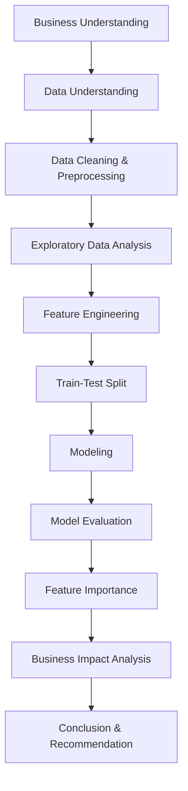

# Capstone-Project-Modul-3-Yosef-Ivander

## Efektivitas Kampanye Marketing Bank

# Project Overview

Proyek ini bertujuan menganalisis efektivitas kampanye marketing bank dalam menawarkan produk deposito kepada nasabah, dengan fokus pada pengaruh kepemilikan pinjaman seperti housing loan dan personal loan terhadap keputusan nasabah membuka deposito.
Melalui pendekatan machine learning classification, proyek ini akan mengidentifikasi faktor-faktor yang memengaruhi respons nasabah terhadap kampanye serta membantu bank meningkatkan strategi targeting marketing agar lebih efektif, efisien, dan berbasis data.

# Workflow

# Business Understanding

# Dataset
Dataset berisi informasi karakteristik nasabah seperti:

Age

Job

Balance

Housing Loan

Personal Loan

Campaign History

Previous Outcome

Target variable:

0 - Tidak Deposit

1 - Deposit

Conversion rate dataset: 47.79%

# Exploratory Data Analysis (EDA)

Beberapa insight utama:

Nasabah tanpa housing loan cenderung lebih banyak melakukan deposit

Balance dan Age menjadi faktor penting dalam keputusan deposit

Riwayat campaign sebelumnya mempengaruhi probabilitas deposit

# Background

Persaingan industri perbankan semakin ketat sehingga bank perlu strategi pemasaran yang tepat untuk meningkatkan produk simpanan seperti deposito.
Namun, tidak semua nasabah merespons kampanye marketing dengan baik. Salah satu faktor yang diduga memengaruhi respons nasabah adalah kondisi finansial mereka, khususnya kepemilikan pinjaman seperti kredit rumah atau pinjaman pribadi.
Tanpa analisis data yang tepat, kampanye marketing berisiko:

* Tidak tepat sasaran
* Biaya marketing tinggi
* Tingkat konversi rendah
* Business Problem

Beberapa permasalahan bisnis yang ingin diselesaikan :
* Apakah nasabah yang memiliki pinjaman cenderung menolak penawaran deposito?
* Faktor apa saja yang paling mempengaruhi keberhasilan kampanye marketing bank?
* Bagaimana bank dapat mengoptimalkan strategi targeting agar kampanye lebih efektif?
* Bagaimana mengurangi biaya marketin tapa menurunkan tingkat konversi nasabah?

# Stakeholders

**Marketing Team Bank** : Menjalankan kampanye promosi produk bank.
**Data Analyst / Data Scientist** : Memberikan insight berbasis data dengan menggunakan model.
**Manajemen Bank (Desicion Maker)** : Menentukan kebijakan marketing.
**Nasabah Bank** : Target kampanye marketing.

# Project Objectives

* Menganalisis faktor yang mempengaruhi keberhasilan kampanye.
* Mengidentifikasi pengaruh kepemilikan pinjaman terhadap keputusan nasabah.
* Mengembangkan model classification untuk prediksi respons nasabah
* Memberikan rekomendasi strategi marketing berbasis data.

# Spesific Objectives

* Melakukan eksplorasi data nasabah bank.
* Menganalisis hubungan variabel loan dengan respons deposito.
* Membangun model machine learning classification.
* Mengevaluasi performa model menggunakan metrik classification.
* Mengidentifikasi variabel paling berpengaruh.
* Memberikan insight actionable untuk marketing bank.
* Business Impact Analysis (Confusion Matrix)
* Peran Confusion Matrix dalam Bisnis

# Business Impact Analysis (Confusion Matrix)
Peran Confusion Matrix dalam Bisnis

Confusion matrix membantu mengevaluasi performa model calssification dalam memprediksi apakah nasabah akan membuka deposito atau tidak.
Dengan memahami hasil prediksi model, bank dapat menentukan strategi marketing yang lebih efektif dan mengurangi biaya kampanye yang tidak tepat sasaran.

| Actual/Predicted | Prediksi(Ya) | Prediksi(Tidak) |
| :--- | :---: | ---: |
| Actual(Ya) | True Positive (TP) | False Negative (FN) |
| Actual(Tidak) | False Positive (FP) | True Negative (TN) |

# Business Impact Tiap Komponen
  ## True Positive (TP)
Nasabah diprediksi membuka deposito dan benar-benar membuka deposito.
  ## Impact Bisnis :
  * Kampanye tepat sasaran.
  * ROI marketing meningkat.
  * Efisiensi biaya promosi.

  ## False Positive (FP)
Diprediksi membuka deposito tetapi sebenarnya tidak.
  ## Impact Bisnis :
  * Biaya marketing terbuang.
  * Resiko nasabah merasa terganggu.
  * Potensi reputasi menurun.

  ## False Negative (FN)
Diprediksi tidak membuka deposito tetapi sebenarnya mau.
  ## Impact Bisnis :
  * Kehilangan peluang revenue.
  * Potensi dana deposito hilang.
  * Target bisnis bisa tidak tercapai.

  ## True Negative (TN)
Diprediksi tidak membuka deposito dan memang tidak.
  ## Impact Bisnis :
  * Bank tidak buang biaya marketing.
  * Kampanye lebih efisien.

# Implikasi Strategi Marketing
  ## Jika FN tinggi :
  * Banyak nasabah potensial tidak ditarget.
  * Solusi :
    * Tingkatkan recall model.
    * Perbaiki segmentasi.
  ## Jika FP tinggi :
  * Campaign terlalu luas.
  * Solusi :
    * Perbaiki precision.
    * Fokus nasabah potensial.

# Machine Learning Strategy
1. Problem Framing
   Masalah ini diformulasikan sebagai Binary Classification Problem, dengan tujuan memprediksi apakah seorang nasabah akan membuka deposito (Yes/No) berdasarkan karakteristik finansialnya, khususnya customer dengan kepemilikan pinjaman.
   * Target Variable (y) : deposit (Yes/No)
   * Tipe Model : Supervised Learning - Classification
   * Output Model : Probabilitas nasabah membuka deposito
   
2. Data Understanding & Feature Selection
Fitur Utama (Core Features)
   Fitur ini menjadi fokus utama analisis:
     * housing - kepemilikan KPR
     * loan - kepemilikan personal loan
Fitur Pendukung
  Digunakan untuk meningkatkan akurasi dan konteks model :
    * age
    * job
    * balance
    * contract
    * month
    * campaign
    * pdays
    * poutcome
Strategi :
    * Loan sebagai variabel utama analisis
    * Variabel lain sebagai kontrol agar hasil lebih realistis
3. Model Selection Strategy
 * Baseline Model : Logistic Regression
 * Candidate Models :
     * Decision Tree
     * Random Forest
  Train-test split menggunakan stratified sampling untuk menjaga proporsi kelas
4. Evaluatin Strategy
Primary Metrics
  * Recall --- Meminimalkan False Negative
  * Precision --- Menghindari pemborosan campaign
  * F1-Score --- Keseimbangan precision & recall

# Model Performance (Random Forest)

| Metric | Score |
| :--- | :---: |
| Accuracy | 70% |
| Precision | 71% |
| Recall | 63% |
| ROC-AUC | 0.759 |

# Confusion Matrix

|          | Pred 0 | Pred 1 |
| -------- | ------ | ------ |
| Actual 0 | 624    | 191    |
| Actual 1 | 273    | 473    |

* True Positive (TP) : 473
* False Positive (FP) : 191
* False Negative (FN) : 273
* True Negative (TN) : 624

# Business Impact Analysis

Tanpa model (hubungi seluruh 1561 data test) :

* Conversion rate : 47.8%
* Biaya (Rp5.000 per call) : Rp7.805.000

Dengan model : 

* Hanya hubungi 664 nasabah (TP + FP)
* Conversion rate meningkat menjadi 71%
* Biaya turun menjadi Rp3.320.000

# Feature Importance (Random Forest)

Fitur paling berpengaruh :

1. Balance
2. Age
3. Campaign
4. Pdays
5. Housing

Insight : Segmentasi berdasarkan saldo dan usiam enjadi strategi utama dalam campaign marketing.

# Trade Off

Recall sebesar 63% menunjukkan masih ada 273 nasabah potensial yang terlewat.

Threshold tuning atau teknik balancing seperti SMOTE dapat digunakan untuk meningkatkan recall.

# Tech Stack

* Python
* Pandas
* NumPy
* Matplotlib
* Scikit-learn

# Conclusion

Model Random Forest berhasil :

* Meningkatkan conversion rate dari 47.8% menjadi 71%
* Mengurangi jumlah kontak sebesar 57%
* Mengoptimalkan biaya campaign

Model ini dapat diintegrasikan ke sistem CRM untuk membantu pengambilan keputusan berbasis data.

# Author

Yosef Ivander
